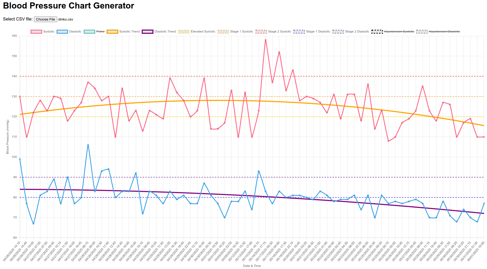

# Blood Pressure Chart Generator

A simple HTML/JavaScript tool that reads a local CSV file of blood pressure and pulse measurements and visualizes them with interactive charts. Designed to visualize trends and manage health data effectively.

- Loads the data from local CSV file
- Plots systolic and diastolic values on a single line chart
- Plots polynomial trend lines for systolic and diastolic
- Shows thresholds lines: Elevated blood pressure, Hypertension Stage 1 & 2, Hypotension
- Toggleable legend items/lines
- Tooltips display paired values: systolic, diastolic, and pulse


## Screenshot




## Usage

1. Download all files in this repository.
2. Open `index.html` in your browser.
3. Click Select CSV file and choose your data file.
4. Chart will render automatically.
5. Hover data points to view detailed tooltips.
6. Click legend items to toggle series visibility (Pulse and Hypotension are hidden by default).


## CSV Format

Your CSV should have the following columns (without header):
```
date,time,sys/dia,pulse
```
- date: ISO date (e.g. 2025-04-26)
- time: 24-hour time (e.g. 14:30)
- systolic/diastolic blood pressure (e.g. 120/80)
- pulse: integer (optional; leave empty if unavailable)

An example file with sample blood pressure readings is provided at: [sample_data.csv](sample_data.csv)
```
2025-04-26,15:40,110/77,56
2025-04-26,19:00,122/67,76
2025-04-27,7:00,128/81,65
2025-04-27,7:50,123/83,62
2025-04-27,9:05,130/89,60
```


## How to Measure Your Blood Pressure

- Sit quietly for 5 minutes, feet flat, back supported.
- Rest the cuff at heart level on bare skin.
- Avoid caffeine, nicotine and exercise for 30 minutes beforehand.
- Measure at the same time every day.
- Take multiple readings and record the results.


## Blood Pressure Categories

The classification of blood pressure values used in this tool is based on guidelines from the [American Heart Association](https://www.heart.org/en/health-topics/high-blood-pressure/understanding-blood-pressure-readings).

| Category             | Systolic (mm Hg) | Diastolic (mm Hg)  |
|----------------------|------------------|--------------------|
| Normal               | < 120            | and < 80           |
| Elevated             | 120–129          | and < 80           |
| Hypertension Stage 1 | 130–139          | or 80–89           |
| Hypertension Stage 2 | ≥ 140            | or ≥ 90            |
| Hypotension          | < 90             | or < 60            |


## Acknowledgements

- Thanks to the developers of [Chart.js](https://github.com/chartjs/Chart.js) for the amazing charting library that powers the visualizations in this tool.
- Thanks to Vladi and Anatoliy for their ideas and testing.


## License

Blood Pressure Chart Generator is available under the [MIT license](LICENSE.md).

